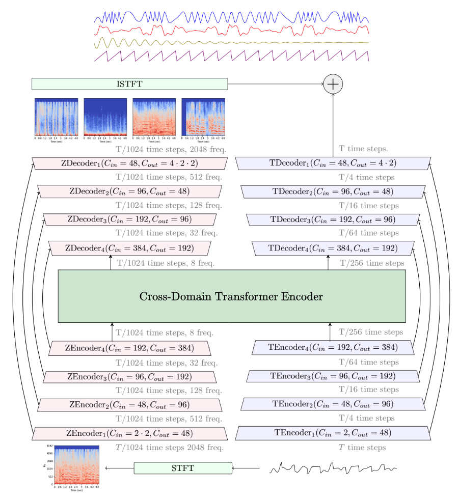

# SunAFXinet: Audio Effect Chain Estimation and Dry Signal Recovery

<!-- 
 -->

**Important**: I'm not an creator of SunAFXinet, but I'm just an implementor of that.

## Based On
This work is a reimplementation of the model and methods described in:

- Title: SunAFXiNet: A Robust Neural Network for Audio AFX Removal
- Authors: Osamu Take, et al.
- Conference: DAFx 2024
- Source: [Audio Effect Chain Estimation and Dry Signal Recovery From Multi-Effect-Processed Musical Signals][sunafxinet]

This paper is licensed under the Creative Commons Attribution 4.0 International License. All intellectual credit for the underlying model architecture and methodology belongs to the original authors. This repository aims to provide a functional and understandable implementation for research and educational purposes. I appreciate for Mr. Take.

## About SunAFXinet

SunAFXinet is an audio effect chain estimation and dry signal recovery model, which is proposed by Osamu Take, Tokyo University in 2024. This repository is an unofficial implement of Sunafxinet.

SunAFXinet is based on a hybrid spectrogram/waveform transformer architecture inspired by [Hybrid Transfer Demucs](https://github.com/facebookresearch/demucs/tree/v4). Thus, this implement contains some codes in Hybrid Transfer Demucs.

This repository originally implement the architecture of sunafxinet in [sunafxinet directry](https://github.com/Makochaaan/SunAFXiNet_implement_overall/tree/main/sunafxinet). There are three architecture files: [afxcdt](https://github.com/Makochaaan/SunAFXiNet_implement_overall/blob/main/sunafxinet/afxcdt.py), [hafx](https://github.com/Makochaaan/SunAFXiNet_implement_overall/blob/main/sunafxinet/hafx.py), and [sunafxinet](https://github.com/Makochaaan/SunAFXiNet_implement_overall/blob/main/sunafxinet/sunafxinet.py). Furthermore, I prepare some utilities to create dataset, train, test validation, inference, evaluate and visulaize.

For more detail about SunAFXinet, please check [original thesis by Mr. Take][sunafxinet]


<p align="center">
</p>

## Requirements

I implement that with Python 3.9. Minimal requirements are same as Demucs. See `environment-[cpu|cuda].yml` if you want to use this implement.

### To train and inference

If you have anaconda installed, you can run from the root of this repository:

```bash
conda env update -f environment-cpu.yml  # if you don't have GPUs
conda env update -f environment-cuda.yml # if you have GPUs
conda activate sunafxinet
pip install -e .
```

This will create a `sunafxinet` environment with all the dependencies installed.

## License

SunAFXinet is released under the Creative Commons Attribution 4.0 International License and Demucs is released under the MIT License as found in the [LICENSE](LICENSE) file.

[sunafxinet]: https://www.dafx.de/paper-archive/2024/papers/DAFx24_paper_53.pdf

[hybrid_paper]: https://arxiv.org/abs/2111.03600
[waveunet]: https://github.com/f90/Wave-U-Net
[musdb]: https://sigsep.github.io/datasets/musdb.html
[openunmix]: https://github.com/sigsep/open-unmix-pytorch
[mmdenselstm]: https://arxiv.org/abs/1805.02410
[demucs_v2]: https://github.com/facebookresearch/demucs/tree/v2
[demucs_v3]: https://github.com/facebookresearch/demucs/tree/v3
[spleeter]: https://github.com/deezer/spleeter
[soundcloud]: https://soundcloud.com/honualx/sets/source-separation-in-the-waveform-domain
[d3net]: https://arxiv.org/abs/2010.01733
[mdx]: https://www.aicrowd.com/challenges/music-demixing-challenge-ismir-2021
[kuielab]: https://github.com/kuielab/mdx-net-submission
[decouple]: https://arxiv.org/abs/2109.05418
[mdx_submission]: https://github.com/adefossez/mdx21_demucs
[bandsplit]: https://arxiv.org/abs/2209.15174
[htdemucs]: https://arxiv.org/abs/2211.08553
